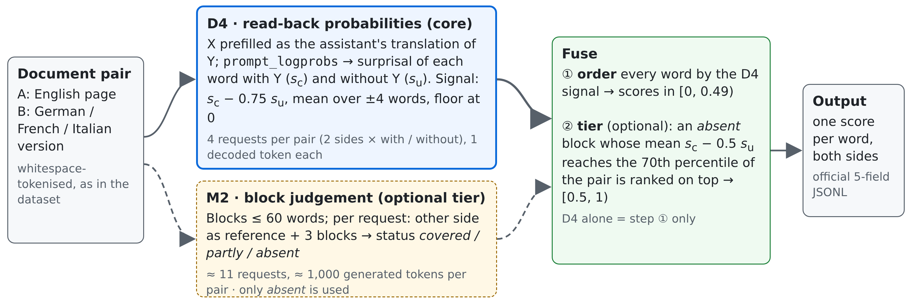
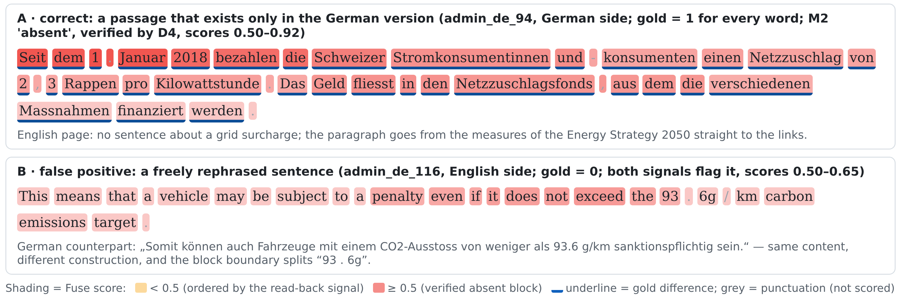

# Technical report — Reading instead of writing: word-level semantic differences from Apertus read-back probabilities

- **Track:** Track 2A — UZH: SwissGov-RSD, Detecting Cross-Lingual Semantic Differences in Swiss Government Websites
- **Event:** Online
- **Team:** Tse-min — Zhengxun Yin (University of Zurich)
- **Demo:** `demo/viewer.html` in the repository — an offline page showing every test and development document pair side by side, words shaded by the submitted score, gold differences underlined, CTFAlign switchable for comparison
- **Code:** `⟨GitHub URL⟩`, project root `track_2a/`; `make run` there reproduces the test predictions

## 1. Summary

We use Apertus to *score* a document rather than ask it to *write* a label for every word. A word that is explained by the other-language page becomes easier to predict once that page is in the prompt; a word whose content is missing on the other side tends to remain surprising. Four teacher-forced requests per document pair measure this effect for both documents, with and without the counterpart page, and each request decodes at most one token (**D4**, Section 3.1). An optional second signal asks Apertus block by block whether a block has any counterpart; blocks judged *absent* and confirmed by the read-back signal form a top tier above the D4 ordering (**M2 + Fuse**, Sections 3.2–3.3). Nothing is trained.

Results on the test split (56 pairs per language; official evaluation script; one run of the configuration frozen on development data): D4 alone reaches a macro Spearman of **0.311**, the submitted Fuse **0.323** (de .412 / fr .189 / it .367), and the organisers' CTFAlign word-alignment system 0.291 on the same documents. In a page-paired bootstrap, Fuse − CTFAlign is +0.032 [+0.009, +0.052]; D4 − CTFAlign is +0.020 [−0.011, +0.045] and Fuse − D4 is +0.012 [−0.001, +0.029], both positive point estimates whose intervals include zero (Section 5.2). The paper's own prompting baseline, re-run with the same Apertus-8B, scores −0.015: 47 % of its requests hit the output limit, mostly in repetition loops (Section 5.5).

Contributions: (1) **contrastive read-back scoring with Apertus** — a zero-training word-level signal from teacher-forced probabilities, bidirectional, on whole documents, through a hosted chat endpoint, at four requests per pair; (2) **a controlled comparison and combination of generative and probabilistic judgements** of the same model, including where each one breaks; (3) **a reproducible evaluation** — parity with the official script, page-paired uncertainty, an acceptance audit, the frozen per-document results shipped with the code, and a Docker entry point that stops instead of degrading when an endpoint lacks the required capability.

## 2. Architecture

The client is plain Python (standard library only, ≥ 3.7) in a `python:3.11-slim` container; the model runs behind the CSCS hosted inference endpoint (vLLM). No GPU and no model weights are needed on the client side. Modules: `surprisal.py` (D4), `blocks.py` and `methods.py` (M2), `fuse.py` (output layer), `scorer.py` / `stats.py` / `audit.py` (evaluation), `client.py` (retries, request log, on-disk cache), `viewer.py` (demo); `README.md` maps every file.

*Figure 1. One document pair (English side A, other side B); both signals run in both directions. The solid path is the standalone system (D4); the dashed path adds the optional M2 tier.*

## 3. Use of Apertus

- **Model:** `swiss-ai/Apertus-v1.5-8B` (Hugging Face) for both signals; 70B was tried on development data and not adopted (Section 5.6)
- **How it is used:** inference only — teacher-forced scoring for D4, generation for M2; no fine-tuning
- **Where it runs:** CSCS hosted endpoint `https://api.inference.cscs.ch/v1` (OpenAI-compatible chat route served by vLLM `0.23.1rc1`); temperature 0, seed 0 for every request

**3.1 D4: read-back probabilities.** For side X of a pair (the other side is Y) we send two chat requests whose last message is an assistant message containing X verbatim:

- conditioned: system "professional translator for the Swiss federal administration …"; user "Here is the ⟨Y-language⟩ version of a page … Write the ⟨X-language⟩ version … faithfully and completely" followed by Y;
- unconditioned: the same system message; user "Write the ⟨X-language⟩ version of a page of a Swiss government website."

Both use the vLLM extensions `continue_final_message=true`, `add_generation_prompt=false`, `prompt_logprobs=0`, `return_token_ids`, `return_prompt_text` and `max_tokens=1`. The log-probabilities of the prefilled tokens are summed per whitespace word, giving the surprisal of word *w* with Y in the prompt, *s*c(*w*), and without it, *s*u(*w*). The ordering signal is

  *v*(*w*) = moving mean over ±4 words of [ *s*c(*w*) − 0.75 · *s*u(*w*) ],  score(*w*) = 1 − exp(−max(*v*, 0) / 3).

Subtracting part of *s*u discounts words that are surprising anyway (names, numbers, rare terms); the moving mean reflects that differences come in spans. The floor at zero is part of the method: the words that become *less* surprising with Y than without it (62–71 %) are all tied at the bottom, which removes noise from their mutual order (Section 5.4). The value is a ranker, not a probability of difference: it contrasts two prompts rather than estimating a pointwise mutual information, and a high value means "worth suspecting", not "proven absent". Tokens are mapped back to words through the returned prompt text (exact on every development and test request; a failed mapping is recorded, not scored as zero).

*Relation to prior work.* D4 follows DiffMask (Vamvas and Sennrich, 2023), which scored a word by how much a masked language model's cross-entropy for it drops when the other document is added, and contrastive conditioning (Vamvas and Sennrich, 2022), which compares translation probabilities under edited sources to find omissions and additions. It is related to context-contrastive token likelihoods such as P-CXMI (Fernandes et al., 2023) and the contrastive forced decoding of PECoRe (Sarti et al., 2024); Sarti et al. (2025) found output-distribution signals the most effective unsupervised internal signal for word-level translation errors. Our score is a task-specific ranker rather than such a measure: the two prompts are not identical up to the context, the unconditioned surprisal is discounted with a development-selected coefficient, and negative values are floored. What we add is the implementation with a general instruction-tuned decoder through a hosted chat endpoint, on whole naturally occurring document pairs in both directions (one teacher-forced pass per side and condition, where DiffMask needs one pass per masked word), and the controlled comparison with generative block judgements of the same model.

**3.2 M2: block coverage judgements.** Each side is cut into blocks of at most 60 words at sentence boundaries. One request shows the other side as REFERENCE (the whole document, or the 1,500 words around the proportionally corresponding position when it is longer) and three numbered BLOCKS, and asks for a JSON object with one status per block: *covered*, *absent* (the block as a whole has no counterpart in the reference) or *partly* (with verbatim quotes of the differing words). The prompt (`prompts/m2_coverage_v1.txt`) contains two short examples built from development-split sentences, uses `response_format={"type": "json_object"}` and `max_tokens=900`. Only the *absent* status turned out to carry information (Section 5.3); *partly* and the quotes are not used. An *absent* judgement means "not found in the reference window", not "absent from the whole page".

**3.3 Fuse.** Every word is ordered by the D4 signal (scores 0.49 · score(*w*), i.e. [0, 0.49)). An *absent* block is added to a top tier (0.5 + 0.5 · score(*w*), i.e. [0.5, 1)) if the mean over its words of *s*c − 0.5 · *s*u reaches the 70th percentile of that quantity over all words of the pair; *absent* blocks that the other side explains well are excluded from the tier and keep their D4 order. The four parameters (percentile 0.7, coefficients 0.5 and 0.75, window ±4) were chosen on 60 development pairs and not changed afterwards. D4 alone is the same system without the tier.

**3.4 Endpoint features.** `python run.py probe` checks by effect that the endpoint honours `prompt_logprobs` on a prefilled assistant message; the Docker entry point stops with exit code 4 if it does not (Section 7). The CSCS gateway ends requests after about 60 s (HTTP 504); D4 requests decode one token and M2 requests about 85, far below that limit.

## 4. Data

**SwissGov-RSD** (Wastl et al., 2026a), CC-BY-4.0, repository `ZurichNLP/SwissGov-RSD` at commit `1807a42`: 224 English pages with their German, French and Italian versions from Swiss federal websites, with word-level difference labels (0 = same meaning, 0.2–1.0 = difference of increasing strength, −1 = punctuation, not scored). Development split: 168 pairs per language (the repository's *dev/train* 134 and *dev/val* 34); test split: 56 pairs per language. The same English page appears at the same position in all three languages, so all resampling is done by page. Gold-difference words make up 12.7 / 10.2 / 18.2 % of the scored development words (de / fr / it) and 10.7 / 8.9 / 16.4 % on test.

- Development labels are read only from `dev/gold_admin_{lang}.jsonl`, which the official script uses (at this commit the German *dev/train* and *dev/val* files still carry pre-re-annotation labels; 89 of 168 documents differ).
- Parameters were selected on **dev60**, 20 pages × 3 languages drawn from *dev/train* (`data/manifests/dev60.json`). *dev/val* was then used for one sensitivity check of the chosen parameters; no parameter was changed as a result.
- The test labels were copied into the project only after the configuration was frozen (7 Oct 2026, 11:40 CEST); the code refuses to read them without an explicit `--allow-test`. The submitted system was evaluated on test once (Section 5); the prompting baseline of Section 5.5 was run on test separately on 8 Oct and did not influence it. The test files are now in the repository so that the judges' `make run` works on a clean checkout.
- Reference predictions (`data/reference/`) come from the organisers' public repositories: CTFAlign with Qwen3-Embedding-4B (Wastl et al., 2026b) and the best encoder of the benchmark repository (mmBERT trained with SimCSE). They are comparison rows only; no model other than Apertus is in our pipeline. The CTFAlign test predictions were downloaded after our test run.
- The texts are public government web pages with no personal data beyond what these pages publish. `data/` (52 MB) holds texts and labels, reference predictions, our predictions, the baseline outputs and the frozen per-document results of every run behind this report.

## 5. Evaluation

**Metric and protocol.** Per language pair, the scores and gold labels of all scored tokens of all documents are pooled into one Spearman correlation; the headline number is the mean over the three pairs. Our scorer and the unmodified official script (`scripts/evaluate_predictions_admin.py`) agree to the last printed digit on every split. Because the correlation is pooled, only the order of the scores matters and scores must be comparable across documents (no per-document normalisation). Protocol: methods and parameters were developed on dev60; full-development and dev/val numbers were computed once; then the configuration was frozen and the test split was run once (six D4 requests failed with HTTP 500 and were re-sent as planned in `docs/FINAL_RUN.md`, parameters untouched: 0.320 → 0.323).

**5.1 Main results.** Table 1 (Spearman; *dev* = 168 pairs per language, *dev/val* = its 34 held-back pairs, *test* = 56 pairs).

| System | Apertus | test de | test fr | test it | **test** | dev | dev/val |
|---|---|---|---|---|---|---|---|
| **Fuse** (submitted) | 8B | **.412** | **.189** | **.367** | **.323** | **.340** | **.321** |
| D4-contrastive (standalone) | 8B | .398 | .176 | .359 | .311 | .319 | .318 |
| M2-verified (0/1) | 8B | .344 | .147 | .247 | .246 | .277 | .208 |
| M2-absent (0/1) | 8B | .325 | .108 | .260 | .231 | .226 | .150 |
| D4-raw (*s*c only) | 8B | .238 | .128 | .236 | .201 | .202 | .222 |
| Paper prompt baseline (b0s) | 8B | −.019 | .004 | −.030 | −.015 | — † | — |
| CTFAlign (Qwen3-Embedding-4B) | no | .330 | .189 | .353 | .291 | .306 | .269 |
| mmBERT-SimCSE | no | — | — | — | — | .221 | .209 |

† b0s was run on dev60 only (60 pairs): −.011. D4-raw scores each word by *s*c (maximum over ±1 word). Human agreement on 25 doubly annotated documents (paper): de .561 / fr .436 / it .651.

Fuse has the best mean on every split. It is above CTFAlign in all three languages on the development data and in German and Italian on test, and ties it in French on test (0.18890 vs 0.18884). The gap to CTFAlign is the same on development and test data (+0.033 / +0.032).

**5.2 Uncertainty.** Paired bootstrap over pages (1,000 resamples, seed 0; in each resample the same pages are drawn for all three languages, with repetition; 95 % percentile intervals; "≤ 0" counts resamples in which the difference was not positive — an empirical tail share, not a p-value):

| Comparison | Difference | 95 % interval | ≤ 0 |
|---|---|---|---|
| test: Fuse − CTFAlign | +0.032 | [+0.009, +0.052] | 5 / 1000 |
| test: D4 − CTFAlign | +0.020 | [−0.011, +0.045] | 116 / 1000 |
| test: Fuse − D4 | +0.012 | [−0.001, +0.029] | 49 / 1000 |
| dev: Fuse − CTFAlign | +0.033 | [+0.020, +0.045] | 0 / 1000 |
| dev: D4 − CTFAlign | +0.013 | [−0.004, +0.027] | 61 / 1000 |
| dev: Fuse − D4 | +0.020 | [+0.010, +0.032] | 0 / 1000 |

The advantage of the submitted system over CTFAlign is supported on both splits. D4 alone is numerically above CTFAlign on both splits, but the paired intervals include zero: on this benchmark, four read-back requests per pair are on a par with the organisers' alignment system. The gain of the M2 tier over D4 alone is supported on development data and is a positive point estimate on test. (Per-system intervals overlap — test Fuse [.267, .373], CTFAlign [.241, .340] — which the paired intervals resolve by removing the shared page-to-page variation.)

**5.3 What the M2 judgements contain.** Share of gold-difference words inside the blocks of each M2 status (full dev; overall rate in parentheses): *absent* blocks .46 / .21 / .45 (de / fr / it; overall .13 / .10 / .18), covering 7–10 % of the words; *partly* blocks .12 / .10 / .17 — the base rate, although they cover 58–63 % of the words; *covered* blocks .07 / .07 / .12. The precision of the quoted words was at the base rate as well (dev60, 0.16–0.21). With this model and prompt, the *absent* judgement is informative in German and Italian and weak in French, and the finer judgements carry no usable information. After verification, 4.8–6.3 % of the words are in the top tier, with gold-difference rates of .65 / .27 / .59 on dev and .55 / .24 / .49 on test.

**5.4 Ablations** (parameters fixed at their frozen values; one change at a time):

| Variant | dev | test |
|---|---|---|
| **Fuse** | **.340** | **.323** |
| … without verification (all M2-absent blocks on top) | .323 | .312 |
| … negative signals keep their order (no floor) | .317 | .298 |
| **D4-contrastive** | **.319** | **.311** |
| … without the *s*u discount | .250 | .248 |
| … without the moving mean | .258 | .244 |
| … negative signals keep their order (no floor) | .300 | .287 |
| … *s*u alone (other document never shown) | .014 | .025 |

The point estimates favour each retained component on both splits, and the signal comes from seeing the other document (*s*u alone ≈ 0); the test gain from the M2 tier is the one difference not resolved by the paired interval (Section 5.2). The parameters were chosen on dev60; the dev/val sensitivity check (percentile 0.6–0.8 × ordering coefficient 0.5–0.75) stayed within .315–.323 and led to no change. A selection effect from choosing four parameters on 60 pairs cannot be excluded completely.

**5.5 The prompting baseline.** b0s reproduces the paper's prompting setup with Apertus: the repository's prompt templates unchanged, its 250-word chunking, `response_format=json_object`; our client and parser. Of 691 chunk requests on test, 322 (47 %) stopped at the output limit, 206 of them inside a repetition loop, and 11 returned no readable JSON. Inside the chunks that did answer, only 45–48 % of the words received a label, and 78–83 % of those were labelled as different (gold: 9–16 %). Restricted to the answered chunks (42–56 % of the scored words), b0s scores −0.011 while Fuse scores 0.323 on the same words. This describes the paper's prompt with Apertus-8B under a 60-second limit, not prompting in general (details: `data/baselines/README.md`).

**5.6 Efficiency and model size.** Cost per document pair on the 60 dev60 pairs, where all three methods ran on the same documents (request counts and tokens from the run logs; latency = mean of the live, uncached requests on the shared CSCS endpoint on 6 Oct 2026 × requests per pair, i.e. the sequential endpoint time; 2 pairs were processed in parallel):

| | Requests | Prompt tokens | Generated tokens | Endpoint time |
|---|---|---|---|---|
| D4 (standalone system) | 4.0 | 3,692 | 4 | 3.1 s |
| M2 | 11.4 | 20,815 | 1,001 | 7.3 s |
| **Fuse = D4 + M2** | **15.4** | **24,507** | **1,005** | **10.4 s** |
| b0s (paper prompt) | 3.8 | 6,455 | 8,085 | 49.4 s |

The M2 tier costs 3.4 times the requests and 2.3 times the endpoint time of D4 alone for +0.01–0.02. A `make run` of the test split (168 pairs) takes 15–25 minutes, the full set (672 pairs) one to one and a half hours. On dev60, Apertus-70B gave no clear advantage (70B for M2 with 8B for D4: .376; 70B for both: .363; 8B for both: .375) while M2 took 15.6 instead of about 7 s per pair, so the 8B model is used throughout. CTFAlign was not timed in the same environment; no speed comparison with it is claimed.

**5.7 French.** All compared systems are weakest on EN–FR (test: Fuse .189, CTFAlign .189); French also has the lowest gold-difference rate (8.9 % on test) and the lowest human agreement (.436). Both of our signals separate less well there — M2's *absent* blocks contain 21 % gold-difference words on dev (de 46 %, it 45 %); on test the median D4 signal of gold-difference words is 0.00 against −0.17 for other words (de 0.24 vs −0.45, it 0.09 vs −0.29) — and the cause is not established.

**5.8 Where the signal breaks.** Table 2 groups the gold-difference spans of the development split by length and gives the median percentile rank (within the language, all scored words) of a span's mean score — 0.50 would be chance:

| Span length (dev; spans de / fr / it) | Fuse | D4-contrastive | CTFAlign |
|---|---|---|---|
| 1 word (882 / 549 / 637) | .69 / .30 / .30 | .35 / .31 / .31 | .70 / .53 / .62 |
| 2–4 words (1,354 / 1,112 / 1,699) | .68 / .60 / .59 | .66 / .58 / .59 | .69 / .60 / .64 |
| ≥ 5 words (629 / 843 / 1,332) | .78 / .66 / .72 | .79 / .67 / .73 | .72 / .66 / .68 |

The read-back signal ranks long missing passages higher than CTFAlign does, but more than half of the single-word differences (a changed number, a more specific term) end up in its zero floor, where CTFAlign's word alignment still places them above chance; the German top tier recovers part of this. Figure 2 shows a typical success and a typical false positive. Other false positives come from free but correct rephrasing, reordering beyond the M2 reference window, and boilerplate present on both sides in different wording.

*Figure 2. Two development documents, scored by the frozen system (Fuse). A: a German-only passage, found by both signals. B: a correct English sentence that both signals flag because its German counterpart is constructed differently.*

## 6. Limitations

- **Endpoint dependence.** D4 needs `prompt_logprobs` and assistant prefill, which are vLLM extensions, not part of the standard OpenAI chat API. Without them the entry point stops (exit code 4); it never delivers M2-only predictions.
- **What the score measures.** It ranks suspicion. It does not distinguish kinds or severity of difference; the annotators' graded labels are reproduced only through the order; single-word differences are largely missed (Section 5.8).
- **The M2 tier is a small, uncertain gain** for 3.4 times the requests: +0.024 over D4 on *dev/train*, +0.003 on *dev/val*, +0.012 on test with an interval that includes zero. D4 is the stable part.
- **Coverage gaps in M2.** 0.2 % of the blocks (dev 31 of 15,731; test 11 of 5,888) received no judgement because the model skipped them; they are scored as "no difference" and listed by the audit as a declared limitation.
- **Long documents.** M2 sees at most 1,500 reference words around the proportional position; D4 always sees the whole other document.
- **Small selection set.** Four parameters were chosen on 60 pairs; the dev/val check and the test result are consistent with the choice but do not rule out a selection effect.

## 7. Reproducibility

- **Run:** `cd track_2a && make run` (the template defines `track_2a/` as the project root; a `Makefile` at the repository root forwards to it). It builds the image and runs `src/entrypoint.sh`: 1/6 offline self-test (95 tests), 2/6 capability gate (`run.py probe --require T2b`: `prompt_logprobs` on a prefilled assistant message must work, otherwise exit 4), 3/6 M2, 4/6 D4, 5/6 Fuse, 6/6 audit. Every step must succeed; an inference step that ends with failed requests (the shared endpoint answers HTTP 500 for a few requests in most runs) is repeated up to three times, re-sending only the failed requests; the audit exits 3 on a fatal finding (missing documents or D4 sides, length or alignment errors, prediction file not matching the gold order) and nothing is copied in that case. It reads `LLM_API_KEY` (required), `LLM_BASE_URL` (default CSCS) and `LLM_NAME` (default `swiss-ai/Apertus-v1.5-8B`). `SPLIT=test` is the default (about 2,750 requests, 15–25 min); `full` = all 224 pairs per language in the organisers' order; `smoke` = 12 development pairs, about 3 minutes. Predictions, summary and audit land in `output/<split>/`; the log and raw requests stay in `output/` and `runs/`.
- **Hardware:** none beyond a machine running Docker; the model runs on the endpoint. Verified end to end with Docker Desktop 4.94 on Windows (x86-64) against the CSCS endpoint (`SPLIT=smoke` and `SPLIT=test`); both paths of the entry point (capable and incapable endpoint) were tested against a mock server.
- **Determinism:** temperature 0 and seed 0 for every request; each request is cached on disk under a hash of its full content, so an interrupted or partly failed run continues where it stopped. Hosted inference with dynamic batching is not guaranteed to be bit-identical across runs: an independent `make run` on 9 Oct from a different machine reproduced 0.322 (de .412 / fr .189 / it .365) against the submitted 0.323, with different prediction files (`docs/reproduction_2026-10-09.md`).
- **Submitted predictions:** `data/predictions/full/tsemin_admin_{de,fr,it}.jsonl.jsonl`, 224 pairs per language in full-set order (from which the official script selects the 56 test pairs), SHA-256 prefixes de `b7e48e339f202c9a`, fr `d3a8b96df69a3c59`, it `514cedff5b8b20f6`.
- **Every number in this report without the endpoint:** the per-document results of the frozen runs are shipped gzipped in `data/frozen_runs/`. `python tools/report_tables.py` recomputes Table 1 and the ablations, `python tools/report_extra.py` the D4 − CTFAlign bootstrap, the cost table and Table 2, `python run.py stats --run data/frozen_runs/<fuse run> --vs ctfalign|d4` the other bootstrap rows, `python run.py audit --run …` the acceptance audit.
- **Commit:** `⟨commit hash at submission⟩`.

## 8. Next steps

The two signals have complementary blind spots — the read-back finds missing passages, alignment finds single changed words — so a combination of D4 with a word-alignment score, and a small supervised model on development labels to turn the ranking into the annotators' severity levels, are the natural next experiments. Self-hosted weights would also expose hidden states in the same forward pass and remove the 60-second limit that shaped the baseline.

## License and development note

Report: Creative Commons Attribution 4.0 (CC-BY-4.0); code: Apache-2.0. All HackApertus projects are open-sourced. Code, analyses and this report were written with the help of an AI coding assistant; all design decisions, runs and checks were made and verified by the team. No model other than Apertus is part of the submitted system; CTFAlign and mmBERT appear only as published comparison predictions.

## References

- Wastl, M., Vamvas, J., and Sennrich, R. (2026a). SwissGov-RSD: A Human-annotated, Cross-lingual Benchmark for Token-level Recognition of Semantic Differences Between Related Documents. *Proceedings of ACL 2026 (Long Papers)*, pp. 31134–31163.
- Wastl, M., Vamvas, J., and Sennrich, R. (2026b). Scaling Unsupervised Word Alignment to Documents via Structural Constraints. arXiv:2608.21023.
- Vamvas, J., and Sennrich, R. (2023). Towards Unsupervised Recognition of Token-level Semantic Differences in Related Documents. *Proceedings of EMNLP 2023*, pp. 13543–13552.
- Vamvas, J., and Sennrich, R. (2022). As Little as Possible, as Much as Necessary: Detecting Over- and Undertranslations with Contrastive Conditioning. *Proceedings of ACL 2022 (Short Papers)*, pp. 490–500.
- Fernandes, P., Yin, K., Liu, E., Martins, A., and Neubig, G. (2023). When Does Translation Require Context? A Data-driven, Multilingual Exploration. *Proceedings of ACL 2023*.
- Sarti, G., Chrupała, G., Nissim, M., and Bisazza, A. (2024). Quantifying the Plausibility of Context Reliance in Neural Machine Translation. *ICLR 2024*.
- Sarti, G., Zouhar, V., Nissim, M., and Bisazza, A. (2025). Unsupervised Word-level Quality Estimation for Machine Translation Through the Lens of Annotators (Dis)agreement. *Proceedings of EMNLP 2025*.
